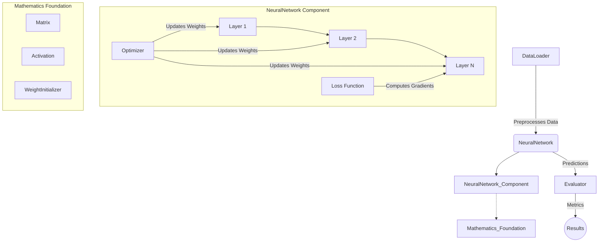

# MiniANN - Minimal Artificial Neural Network Library

MiniANN is a lightweight, zero-dependency, modular Artificial Neural Network library built entirely in C++17. It is designed to be highly readable, extensible, and mathematically explicit, avoiding heavy external dependencies like Eigen or BLAS. It is suitable for educational purposes, rapid prototyping, and lightweight embedded applications.

## 🏗️ Architecture Diagram



## 🧩 Implementation Details

The project is structured into highly cohesive and decoupled modules:

- **Matrix (`Matrix.h/cpp`)**: A custom 2D matrix class supporting standard algebraic operations (addition, multiplication, element-wise operations, transposition).
- **Layer (`Layer.h/cpp`)**: Represents a dense (fully connected) layer. Stores weights, biases, and handles forward/backward passes.
- **Activation (`Activation.h/cpp`)**: Provides implementations for standard activation functions including `ReLU`, `Sigmoid`, and `Tanh`.
- **Loss (`Loss.h/cpp`)**: Evaluates the error during training. Implements Mean Squared Error (`MSE`) and `BinaryCrossEntropy`.
- **Optimizer (`Optimizer.h/cpp`)**: Handles weight updates utilizing gradients. Supports standard `SGD`, `Momentum`, and `Adam` optimizers.
- **WeightInitializer (`WeightInitializer.h/cpp`)**: Strategies for weight initialization, including `He` (for ReLU), `Xavier` (for Sigmoid/Tanh), and `RandomUniform`.
- **DataLoader (`DataLoader.h/cpp`)**: A utility class to parse CSV datasets, normalize features, one-hot encode targets, create minibatches, and split into train/test sets.
- **NeuralNetwork (`NeuralNetwork.h/cpp`)**: The core orchestrator. Constructs the network layer by layer, coordinates the forward and backward passes, and executes the training loop.
- **Evaluator (`Evaluator.h/cpp`)**: Computes comprehensive evaluation metrics post-training, such as Accuracy, Precision, Recall, F1-Score, and generates Confusion Matrices.

## 🚀 Cross-Platform Support

MiniANN is fully cross-platform and compiles seamlessly on **Windows**, **macOS**, and **Linux** utilizing standard C++17. The project does not rely on OS-specific headers.

### Build Instructions

**Prerequisites:**
- C++17 compatible compiler (GCC, Clang, or MSVC)
- CMake (3.10 or higher)

#### Windows, macOS, and Linux
```bash
# 1. Clone the repository
git clone https://github.com/yourusername/MiniANN.git
cd MiniANN

# 2. Configure the build with CMake
cmake -S . -B build

# 3. Compile the project
cmake --build build

# 4. Run the demonstration
./build/miniann_demo             # On macOS/Linux
.\\build\\Debug\\miniann_demo.exe  # On Windows
```

## 🧪 Testing

The library includes an integration test suite validating matrix operations, layer activations, loss convergences, and end-to-end training pipelines.

```bash
# Compile and run tests
cmake --build build --target miniann_tests

# Run tests
./build/miniann_tests             # On macOS/Linux
.\\build\\Debug\\miniann_tests.exe  # On Windows
```
