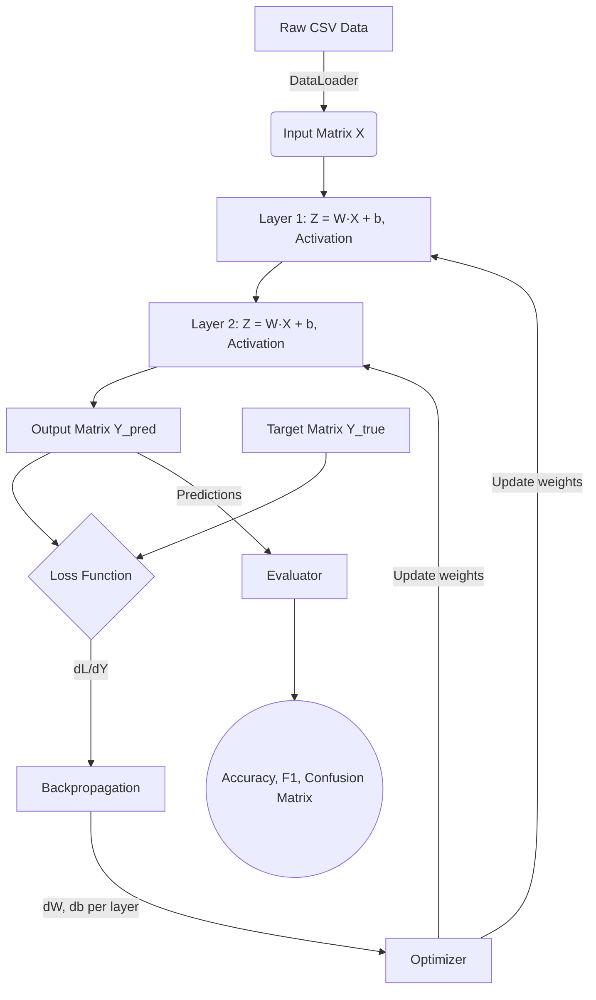
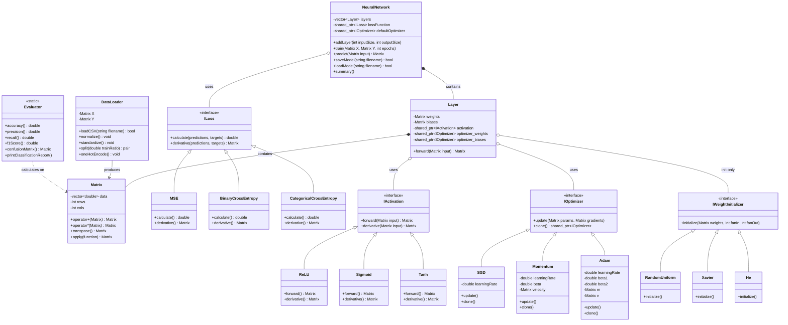

# MiniANN

A lightweight, zero-dependency neural network library written in C++17. MiniANN implements a fully manual feedforward neural network from scratch — including matrix operations, backpropagation, and gradient-based optimization — with no external ML libraries.

---

## Table of Contents

- [Overview](#overview)
- [Architecture](#architecture)
- [Components](#components)
- [Build Instructions](#build-instructions)
- [Usage](#usage)
- [Testing](#testing)

---

## Overview

MiniANN provides a modular, object-oriented framework for building and training feedforward neural networks. All core operations — matrix math, forward/backward passes, loss computation, and weight updates — are implemented from first principles in standard C++17.

**Key properties:**
- Zero external dependencies (standard library only)
- C++17, cross-platform (Linux, macOS, Windows)
- Column-major matrix layout: each column is one sample, enabling batched operations
- Supports binary and multi-class classification, and regression
- Pluggable activations, optimizers, loss functions, and weight initializers via interfaces

---

## Architecture

### Training Pipeline



### UML Class Diagram



---

## Components

### Matrix

The core data structure. All features (inputs, weights, biases, gradients) are represented as `Matrix` objects.

- Internal storage uses a flat `std::vector<double>` for cache efficiency and automatic memory management (RAII)
- Column-major convention: a matrix of shape `(features, samples)` stores each sample as a column
- Supports: matrix multiplication, element-wise operations, transposition, scalar scaling, and `apply()` for arbitrary element-wise functions

### Layer

Represents a single fully-connected (dense) layer.

- Holds weight matrix `W` (shape: `outputSize × inputSize`) and bias vector `b` (shape: `outputSize × 1`)
- Caches the input and pre-activation `Z` during `forward()` for use in `backward()`
- Each layer holds two independent optimizer instances — one for weights, one for biases — to maintain separate gradient histories

### NeuralNetwork

The top-level orchestrator.

- Manages a sequence of `Layer` objects and a shared loss function
- `train()` runs the full epoch loop: mini-batch extraction → forward pass → loss → backward pass → weight update
- `saveModel(filename)` and `loadModel(filename)` allow persisting trained network states to text files
- `setOptimizer()` uses `clone()` on the optimizer interface to give each layer its own independent state, preventing stateful optimizers (Adam, Momentum) from sharing accumulators across layers

### Activation Functions

All activations implement `IActivation` with `forward()` and `derivative()` methods.

| Class | Formula | Typical Use |
|---|---|---|
| `ReLU` | `max(0, x)` | Hidden layers |
| `Sigmoid` | `1 / (1 + e^-x)` | Binary output layer |
| `Tanh` | `tanh(x)` | Hidden layers (zero-centered) |
| `SoftMax` | `exp(x) / sum(exp(x))` | Multi-class output layer |

### Loss Functions

All loss functions implement `ILoss` with `calculate()` and `derivative()` methods. Both are normalized by the number of elements so gradient magnitude is consistent regardless of batch size.

| Class | Use Case |
|---|---|
| `MSE` | Regression |
| `BinaryCrossEntropy` | Binary classification (Sigmoid output) |
| `CategoricalCrossEntropy` | Multi-class classification (one-hot targets) |

### Optimizers

All optimizers implement `IOptimizer` with `update()` and `clone()`. `clone()` returns a fresh instance with the same hyperparameters but zeroed internal state, used to create per-layer optimizer copies.

| Class | Notes |
|---|---|
| `SGD` | `W = W - lr * dW` |
| `Momentum` | Accumulates exponentially weighted gradient history to dampen oscillations |
| `Adam` | Maintains per-parameter first and second moment estimates for adaptive learning rates |

### Weight Initializers

All initializers implement `IWeightInitializer` and are applied once at layer construction.

| Class | Formula | Recommended For |
|---|---|---|
| `RandomUniform` | Uniform distribution in `[-0.5, 0.5]` | General use |
| `Xavier` | `sqrt(2 / (fanIn + fanOut))` scale | Sigmoid / Tanh |
| `He` | `sqrt(2 / fanIn)` scale | ReLU |

### DataLoader

Handles all data ingestion and preprocessing.

- Parses CSV files with automatic header detection, delimiter configuration, and string label encoding
- `normalize()` — min-max scaling per feature to `[0, 1]`
- `standardize()` — Z-score scaling per feature to zero mean, unit variance
- `split(ratio)` — random train/test split; normalization should be applied **after** splitting to each subset independently to avoid data leakage
- `oneHotEncode()` — converts integer class labels into one-hot row vectors for multi-class output

### Evaluator

A fully static utility class for post-training evaluation.

| Method | Description |
|---|---|
| `accuracy()` | Fraction of correctly classified samples |
| `precision(c)` | TP / (TP + FP) for class `c`; pass `-1` for macro average |
| `recall(c)` | TP / (TP + FN) for class `c`; pass `-1` for macro average |
| `f1Score(c)` | Harmonic mean of precision and recall |
| `confusionMatrix()` | Returns an `N×N` matrix of predicted vs. true class counts |
| `printClassificationReport()` | Prints a formatted per-class and averaged metrics table |

---

## Build Instructions

**Prerequisites:**
- C++17 compatible compiler (GCC 7+, Clang 5+, or MSVC 2017+)
- CMake 3.10 or higher

```bash
# Clone the repository
git clone https://github.com/yourusername/MiniANN.git
cd MiniANN

# Configure
cmake -S . -B build

# Build
cmake --build build

# Run the demo (macOS / Linux)
./build/miniann_demo

# Run the demo (Windows)
.\build\Debug\miniann_demo.exe
```

---

## Usage

The following example loads a CSV dataset, builds a two-hidden-layer network, trains it, and prints evaluation metrics.

```cpp
#include "NeuralNetwork.h"
#include "DataLoader.h"
#include "Evaluator.h"
#include "Activation.h"
#include "Loss.h"

int main() {
    // 1. Load data
    DataLoader loader;
    loader.loadCSV("data/dataset.csv", -1, true, ',');

    // 2. Preprocess: encode labels, split, then normalize each split
    loader.oneHotEncode();
    auto [trainSet, testSet] = loader.split(0.8, true);
    trainSet.normalize();
    testSet.normalize();

    int inputSize  = trainSet.getNumFeatures();
    int outputSize = trainSet.getNumTargets();

    // 3. Build network
    NeuralNetwork nn;
    nn.addLayer(inputSize, 64, make_shared<ReLU>(),     make_shared<He>());
    nn.addLayer(64,         32, make_shared<ReLU>(),     make_shared<He>());
    nn.addLayer(32, outputSize, make_shared<Sigmoid>(),  make_shared<Xavier>());

    nn.setLoss(make_shared<MSE>());
    nn.setOptimizer("adam", 0.001);
    nn.summary();

    // 4. Train
    nn.train(trainSet, testSet, /*epochs=*/50, /*batchSize=*/32, /*verbose=*/true);

    // 5. Evaluate
    Matrix preds = nn.predict(testSet.getX());
    Evaluator::printClassificationReport(preds, testSet.getY());

    return 0;
}
```

---

## Testing

The integration test suite validates matrix arithmetic, layer forward/backward passes, loss functions, and end-to-end training convergence.

```bash
# Build and run tests
cmake --build build --target miniann_tests

# macOS / Linux
./build/miniann_tests

# Windows
.\build\Debug\miniann_tests.exe
```
