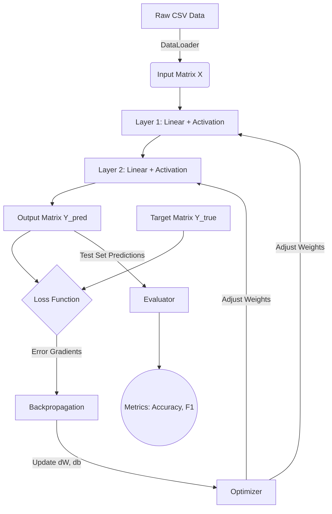
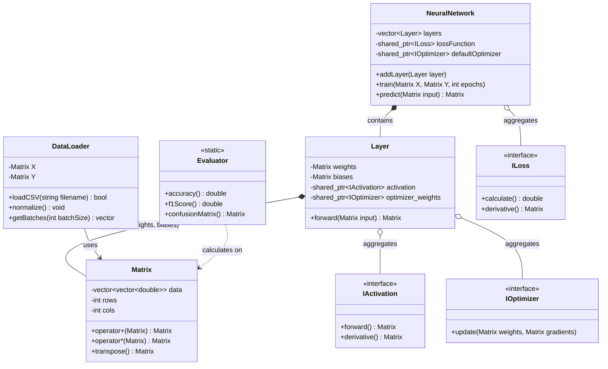

# MiniANN - Minimal Artificial Neural Network Library

MiniANN is a highly modular, lightweight, and zero-dependency Artificial Neural Network library built natively in C++17. Designed with educational clarity and architectural robustness in mind, it provides a full suite of features to load datasets, build arbitrary feed-forward topologies, and evaluate model performance.

---

## 🌊 Architecture and Dataflow

The architecture fundamentally revolves around the concept of representing data as matrices and propagating them through sequential transformations (layers). 

### High-Level Workflow
1. **Data Ingestion:** The `DataLoader` reads raw CSV data, performs normalization, and splits the data into manageable mini-batches.
2. **Forward Propagation:** The `NeuralNetwork` receives these batches (represented as `Matrix` objects) and passes them sequentially through each `Layer`. Each layer computes `Z = W * A_prev + b`, applies an `Activation` function, and forwards the result.
3. **Loss Computation:** The final layer's output is compared against the target labels using a `Loss` function (e.g., MSE or Cross-Entropy) to compute the total error and the initial gradient.
4. **Backward Propagation:** Gradients are propagated backwards. Each `Layer` calculates how its weights and biases contributed to the error, pushing the error gradient further back.
5. **Optimization:** The `Optimizer` takes the calculated gradients and updates the internal weights/biases of each layer using strategies like SGD, Momentum, or Adam.
6. **Evaluation:** Post-training, the `Evaluator` calculates human-interpretable metrics (Accuracy, F1-Score, Confusion Matrix).



### UML Class Diagram



---

## 🛠️ Implementation Details & Design Choices

The project leverages robust Object-Oriented Programming (OOP) paradigms such as **Polymorphism**, **Encapsulation**, **Composition**, and the **Strategy Pattern**. The workload is structurally divided into three core pillars:

### Person 1: Core Mathematical Foundation & Layers
*Responsibility: The fundamental data structures and layer abstractions.*

- **`Matrix` Class (The Engine):** 
  - **Design:** Instead of raw double pointers (`double**`), `std::vector<double>` is used internally in a flattened 1D array to represent 2D matrices. This ensures cache locality, avoids memory leaks, and leverages RAII (Resource Acquisition Is Initialization).
  - **Features:** Overloads operators for intuitive math syntax. Implements matrix multiplication (dot product), element-wise addition/subtraction, and transposition. 
- **`IWeightInitializer` (Strategy Pattern):**
  - **Design:** A purely virtual base class (Interface). 
  - **Implementations:** `RandomUniform`, `Xavier` (optimal for Sigmoid/Tanh to prevent vanishing gradients), and `He` (optimal for ReLU).
- **`Layer` Class:**
  - **Encapsulation:** Weights (`W`) and biases (`b`) are kept private. The layer state (inputs, pre-activations, post-activations) is cached internally during the `forward()` pass to be reused efficiently during the `backward()` pass.
  - **Composition:** A Layer "has-a" `IActivation` and "has-a" `IWeightInitializer` via `std::shared_ptr`. This allows dynamic injection of behavior without modifying the layer logic.

### Person 2: Algorithms (Activations, Optimizers, Losses)
*Responsibility: The calculus and gradient descent methodologies.*

- **`IActivation` Interface:**
  - **Polymorphism:** Defines `forward(Matrix)` and `derivative(Matrix)`. 
  - **Implementations:** 
    - `ReLU`: Fast, prevents gradient vanishing. Derivative is 1 for `x>0`, else 0.
    - `Sigmoid`: Smooth, maps to [0,1]. Used predominantly in output layers for probability.
    - `Tanh`: Maps to [-1, 1], zero-centered.
- **`IOptimizer` Interface:**
  - **Design Choice:** Optimizers maintain internal state (e.g., velocity for Momentum, moments for Adam). This requires instantiating unique optimizer states for *each layer*. The interface allows cloning `std::shared_ptr<IOptimizer> clone()` so the network can seamlessly duplicate the chosen optimizer configuration for every layer.
  - **Implementations:** 
    - `SGD`: Standard gradient descent.
    - `Momentum`: Accumulates past gradients to accelerate through flat regions.
    - `Adam`: Computes adaptive learning rates for each parameter using first and second moments.
- **`ILoss` Interface:**
  - **Design:** Defines `calculate(predictions, targets)` returning a scalar error, and `derivative(predictions, targets)` returning the gradient matrix `dY`.
  - **Implementations:** `MSE` (Mean Squared Error, great for regression) and `BinaryCrossEntropy` (ideal for classification).

### Person 3: Orchestration, Data, & Evaluation
*Responsibility: Tying the mathematical components into a usable, high-level user API.*

- **`NeuralNetwork` Class:**
  - **Composition & Orchestration:** Maintains a `std::vector<Layer>` and a `std::shared_ptr<ILoss>`. 
  - **Workflow:** Exposes `addLayer()`, `train()`, and `predict()`. The `train()` method manages the epoch loops, triggers mini-batch extractions from the DataLoader, runs the forward pass, calculates loss, executes backpropagation, and logs progress.
- **`DataLoader` Class:**
  - **Data Management:** Parses CSV strings into `Matrix` objects. 
  - **Utility:** Implements statistical Normalization (Z-score standard scaling) to ensure stable gradient descent. Implements one-hot encoding for categorical classification.
  - **Batching:** Dynamically chunks the dataset into `std::pair<Matrix, Matrix>` (X_batch, Y_batch) during training loops.
- **`Evaluator` Class:**
  - **Design Choice:** Implemented entirely with `static` methods. It behaves as a stateless utility namespace rather than an instantiated object. 
  - **Metrics:** Computes robust statistical proofs of the model's success: Accuracy, Precision, Recall, F1-Score, and generates console-friendly Confusion Matrices.

---

## 🚀 Cross-Platform Support

MiniANN is fully cross-platform and compiles seamlessly on **Windows**, **macOS**, and **Linux**. It rigidly adheres to standard C++17 and entirely avoids OS-specific bindings. 

### Build Instructions

**Prerequisites:**
- C++17 compatible compiler (GCC, Clang, or MSVC)
- CMake (3.10 or higher)

#### Universal Build Steps (macOS / Linux / Windows)
```bash
# 1. Clone the repository
git clone https://github.com/yourusername/MiniANN.git
cd MiniANN

# 2. Configure the build with CMake
cmake -S . -B build

# 3. Compile the project
cmake --build build

# 4. Run the demonstration
./build/miniann_demo             # On macOS/Linux
.\\build\\Debug\\miniann_demo.exe  # On Windows
```

## 🧪 Testing

The library includes an extensive integration test suite validating matrix dimensions, layer activations, loss convergences, and end-to-end training pipelines.

```bash
# Compile and run tests
cmake --build build --target miniann_tests

# Run tests
./build/miniann_tests             # On macOS/Linux
.\\build\\Debug\\miniann_tests.exe  # On Windows
```
